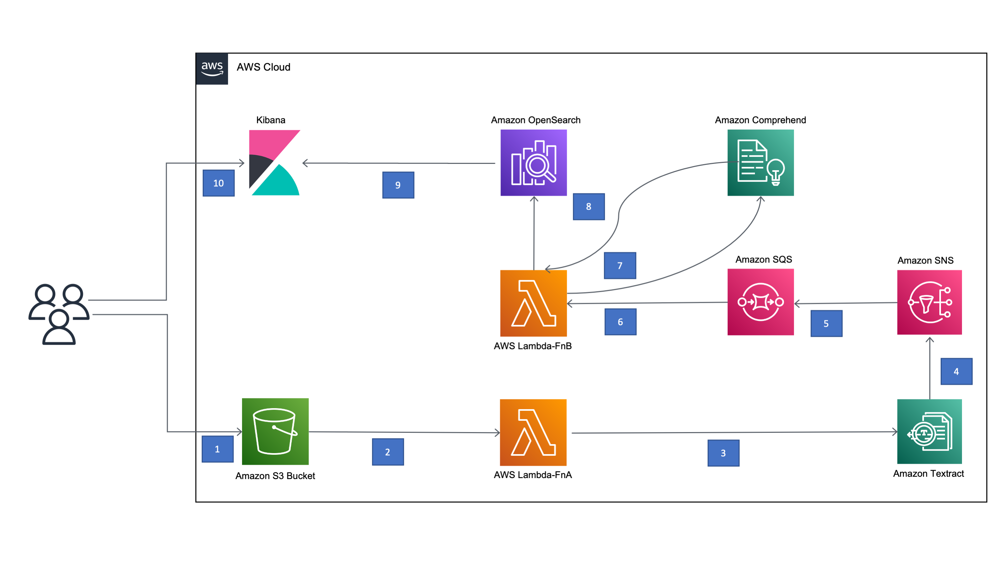

# Automated data extraction for Well Data with AWS Textract

Traditionally, many businesses maintained their business documents like invoice, sales memo, purchase order, vendor related document, inventory document etc in physical format. As more and more businesses are moving towards digitizing their business processes, it is becoming challenging to effectively manage all the physical documents and perform business analytics on them. For example, Oil and Gas industries have numerous documents that are generated through the exploration and production life cycle of an oil well. These documents possess key information, such as Well Number, API Well Number, Lease Number, Water Depth, etc., all these data points are used to build insights and make informed business decisions.

As, documents are usually stored in a paper format, making information retrieval time consuming and cumbersome. Also, documents that are available in a digital format, do not have adequate meta data associated to efficiently perform search and build insights.

In this post, you will learn how to build a text extraction solution leveraging Amazon Textract service, that automatically extracts text and data from scanned documents, uploaded into Amazon Simple Storage Service  (S3). And how to find insights and relationships in the extracted text using Amazon Comprehend. This data is indexed and populated into Amazon Openseacrh service to search and visualize it in Kibana dashboard

## Architecture

**a. Lambda-FnA**

**b. Lambda-FnB**

 

Following are the high-level steps:
1.	User uploads an image file or pdf document to Amazon S3 for analysis.

2.	Amazon S3 event triggers AWS Lambda Function Fn-A

3.	AWS Lambda Function Fn-A invokes Amazon Textract to extract text as key-value pairs from image or PDF	

4.	Amazon Textract sends the extracted keys from image/pdf to Amazon SNS	

5.	Amazon SNS notifies Textract completion process with the extracted keys to Amazon SQS	

6.	AWS SQS triggers AWS Lambda Function Fn-B with the extracted keys	

7.	AWS Lambda Function Fn-B invokes Amazon Comprehend for the custom entity recognition

8.	The data is indexed and loaded into Amazon Opensearch

9.	Kibana processes the indexed data

10.	User accesses Kibana to search documents

Cleanup:
•	Step#1. Shutdown OpenSearch domain

•	Step#2. Delete the Comprehend endpoint

•	Step#3. Clear S3 bucket with all the objects

Conclusion:
As you have learned in this post, you can build an ML-based text extraction solution to uncover the unstructured data from pdfs or images.  Data grows at a very fast pace in any industry and it would be difficult to derive intelligence from diverse data sources unless you incorporate some sort of data extraction and optimization function. You can gain insights into the undiscovered data, by leveraging managed ML services, Amazon Textract and Amazon Comprehend.

The extracted data from pdfs or images is indexed and populated into Amazon OpenSeacrh. You can use Kibana to search and visualize the data. By implementing this solution, customers can reduce the costs in physical document storage, labor costs in manually identifying relevant information. 

This solution eliminates manual identification of relevant information, and drives decision making efficiency. While we discussed oil and gas industry vertical as an example, this solution can be applied to any industry that has physical/scanned documents including legal documents, purchase receipts, inventory reports, invoices and purchase orders, etc.

## License

This library is licensed under the MIT-0 License. See the LICENSE file.
